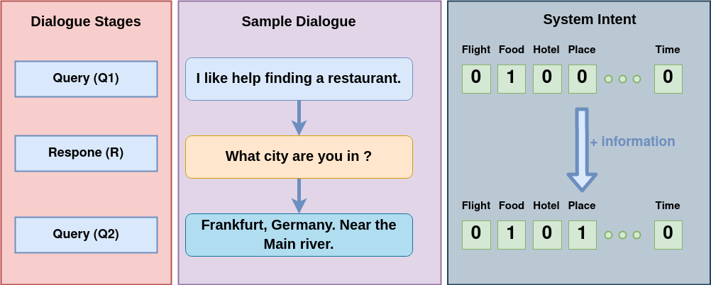
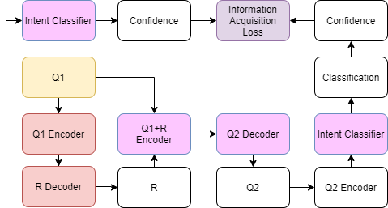
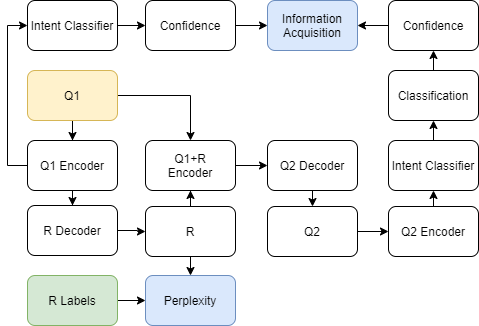

# Just To Be Sure: Building A Virtual Assistant With Active Listening Skills

Task-based chatbots tend to suffer from either overconfidence or ignorance&mdash;giving a response that is confidently wrong or completely uncertain (e.g."I don't know"). A chatbot that could identify the source of its uncertainty and ask a clarifying question would lessen the burden of query reformulation for the user. We introduce a two-turn query-response-query (QRQ) task, in which a user queries the chatbot and the chatbot must ask a clarifying question, which results in a second user query that clarifies the user's intent. We evaluate performance in two ways: 1) by the perplexity of the response on the Taskmaster-2 dataset, and 2) by information acquisition between the first user query and the second user query, as measured by an intent classifier. We train a variety of architectures for these objectives, including a supervised encoder-decoder transformer and an unsupervised system trained to acquire more information from the second query than the first. Although the unsupervised system does not currently improve on baseline, there are positive indications that a similar approach could yield positive results in future.

<div align="center">

  
  Figure 1: Stages of the QRQ system with an example dialogue.
</div>

## Introduction

Many of the current industrial-level voice assistants fall short in two areas: accuracy and specificity. These shortcomings can be addressed by rule-based systems that try to account for all request types (e.g. Alexa Skills and Google Assistant Actions), but even with these kinds of complicated rule-based systems sourced from thousands of developers, it is not hard to push the voice assistant into a domain where it cannot respond accurately or specifically. 

We aim to reduce the number of inaccurate and ambiguous responses by training an assistant to respond to a user query with a clarifying question, which then prompts the user to provide a second query that clarifies the user's initial intent. By asking a clarifying question and better identifying the user intent, the assistant can avoid giving confidently wrong responses. Likewise, an ambiguous response such as "I don't know" can be replaced with a more specific response if the assistant asks a clarifying question and receives a second query.

With current voice assistant models, a common source of friction in human-assistant interaction is the experience of the user needing to communicate their intentions multiple times in order to receive the desired response from the assistant. This often acts as a barrier in humans choosing to interact through voice assistance. This is a frustrating, stressful, and mentally demanding task for the user. However, if the assistant could offer a response that clues the user in on what it is uncertain of, the user has a better chance at re-framing the query in a way that results in a successful interaction with the assistant

We train a system in a three-turn scenario, where the user provides a query (Q1), the assistant provides a response (R), and the user provides another query (Q2) that increases the amount of information provided to the assistant. We do so in an unsupervised manner, such that the only necessary data is a dataset of user queries. We term this task "QRQ". Because our model is trained with an objective to maximize the information gain, we call our model the "Information Acquisition (IA) Transformer Model".

We fine-tune a generatively pre-trained transformer as the main component of our pipeline, to provide the ability to process any query expressed in natural language, as well as respond in natural language. Furthermore, we leverage a pre-trained language model as a language partner, to remove the reliance on a large dataset of Q-R-Q triples. We also use an intent classification model at turn 1 and turn 3 of the conversation, and train with the objective of increasing information between turn 1 and turn 3. This turns the task into an unsupervised learning problem, in which the model learns to respond based solely on a query dataset. This has broad applications for any scenario with a large number of query examples, but no ground truth responses (e.g. any currently deployed voice assistant has access to almost unlimited queries).


Figure 1 shows the high-level control flow of our IA model. In the first stage (T1), the user provides a query (Q1). The model predicts a multi-label intent vector for that user's query. Based on the predicted intent vector, the natural language generation module generates a clarifying question as its response (R) which prompts the user to ask another query (Q2), providing the system with more information than before (i.e., more slots in the multi-label intent vector is filled). For example, in Figure 1, the system response 'What city are you in?' directed the user to query 'Frankfurt, Germany...' such that the system has more information about the user's intent than before.  

The primary contributions of our system are as follows:

- We propose an evaluation task, which we term "QRQ", for the ability of an assistant to clarify the intent of a user.
- We provide an end-to-end language model for clarifying response generation, removing reliance on a manually curated dictionary of intent-response pairs.
- We provide an unsupervised training scheme in which a neural network can learn to provide a clarifying response without seeing any examples of clarifying responses.

## Related Work

Our work is related to research in the areas listed below.

### Existing apps and products

There is a rich line of work on developing conversational agents where natural language processing lies at the heart of the technology. Some of them engage users in a text-based conversations to draw out their views and opinions and ask open-ended questions to collect the data that they need. Past studies have examined chatbots as personal assistants, interviewers, mental health supporters and even AI companions. The major issues with these conversational agents are inaccuracy and ambiguity. Both inaccuracy and ambiguity show a lack of understanding of user intent. In this work we apply the active listening principle of asking clarifying questions to mitigate these problems by requesting further information.

### Uncertainty

Uncertainty estimation is important for ensuring safety and robustness of AI systems and chatbots. Some works aim to investigate how to obtain uncertainty estimates for tokens in a sequence and for whole sequence classification. In order to decrease the uncertainty of our model, our agent asks clarifying questions which leads the model to gain more certainty about the user's query. To measure model performance before and after asking a clarifying question, we introduce the "Information Acquisition Score" described in section 4.3. 

### Natural language generation and language models

Over the past few years, several chatbot platforms have been developed to facilitate the creation of chatbots. Some of these platforms have NLP capabilities for the creation of chatbots with active listening capabilities. More recently, research uses language models such as T5 to create chatbots. For the current work, we used the pre-trained T5 transformer model. We rely on this pre-trained transformer to act as a language partner, allowing us to train our model in an essentially unsupervised manner.

## Dataset

<table align="center">
  <thead align="left">
    <tr>
      <th colspan="3">"conversation_id" : "dlg-00187b735-345e-4c43-b744-e955b6836c43"<br>"instruction_id" : "movie-26"</th>
    <tr>
      <th><b>Annotation</b></th>
      <th>Speaker</th>
      <th>Text</th>
    </tr>
    </tr>
  </thead>
  <tbody align="left">
    <tr>
      <th rowspan="5"><b>movie_search.location.theater</b></th>
      <th>Assistant</th>
      <th>How can I help you?</th>
    </tr>
    <tr>
      <th>User</th>
      <th>What movies are playing?</th>
    </tr>
    <tr>
      <th>Assistant</th>
      <th>I can help you with your movie search.</th>
    </tr>
    <tr>
      <th>Assistant</th>
      <th>Where are you located?</th>
    </tr>
    <tr>
      <th>User</th>
      <th>Davis, California</th>
    </tr>
    <tr>
      <th rowspan="2"><b>movie_search.genre</b></th>
      <th>Assistant</th>
      <th>Do you have a type of movie you wanted to go see?</th>
    </tr>
    <tr>
      <th>User</th>
      <th>Action</th>
    </tr>
    <tr>
      <th rowspan="6"><b>movie_search.name.movie</b></th>
      <th>Assistant</th>
      <th>Just one moment</th>
    </tr>
    <tr>
      <th>Assistant</th>
      <th>Here is what I found</th>
    </tr>
    <tr>
      <th>Assistant</th>
      <th>Baby driver</th>
    </tr>
    <tr>
      <th>Assistant</th>
      <th>The mummy</th>
    </tr>
    <tr>
      <th>Assistant</th>
      <th>Guardians of the Galaxy: Vol 2.</th>
    </tr>
    <tr>
      <th>User</th>
      <th>The mummy</th>
    </tr>
    <tr>
      <th rowspan="4">movie_search.time.start</th>
      <th>Assistant</th>
      <th>Okay. The Mummy is playing at 4:30 pm this afternoon<br>at Regal Davis Stadium 5.</th>
    </tr>
    <tr>
      <th>User</th>
      <th>Ok</th>
    </tr>
      <th>Assistant</th>
      <th>Enjoy your movie!</th>
    </tr>
    <tr>
      <th>User</th>
      <th>Thanks!</th>
    </tr>
  </tbody>
</table>
<div align="center">
  Table 1: An example of a conversation with annotations from the Taskmaster-2 dataset.
</div>
<br>

We use the Taskmaster-2 Dataset, an extension of the Taskmaster-1 Dataset.
Taskmaster-2 includes 17,289 dialogues (341,801 utterances) in 7 domains.
Each utterance is fully annotated using 90 possible annotations.
We define these annotations as intents for the data. A sample dialogue can be seen in Table 1.
We use individual user utterances (152,668 instances) as well as concatenated consecutive user utterances (138,892 instances) to train the intent classifier.
We use user/assistant pairs (147,875 instances) to fine-tune the QR model.
We use users/assistant/user triples (138,892 instances) to fine-tune the QRQ model conversational partner.

<table align="center">
  <thead align="left">
    <tr>
      <th></th>
      <th>Label</th>
      <th>Text</th>
    </tr>
  </thead>
  <tbody align="left">
    <tr>
      <th rowspan="3">Baseline</th>
      <th>Input Text</th>
      <th>I would like you to help me finding a hotel in San Francisco, Downtown area, California.</th>
    </tr>
    <tr>
      <th>Output Text</th>
      <th>Ich m¨ochte Sie bitten, mir bei der Suche nach einem Hotel in San Francisco, Downtown area, California zu helfen.</th>
    </tr>
    <tr>
      <th>Target Text</th>
      <th>What is the price range?</th>
    </tr>
    <tr>
      <th rowspan="3">Fine-tuned</th>
      <th>Input Text</th>
      <th>I'd like to see the Edge of Tomorrow trailer.</th>
    </tr>
    <tr>
      <th>Output Text</th>
      <th>Okay, I have your personal details on file. Your order will be ready for pickup in 20 minutes.</th>
    </tr>
    <tr>
      <th>Target Text</th>
      <th>Anything else I can help you with?</th>
    </tr>
  </tbody>
</table>
<div align="center">
  Table 2: Sample query/response text from our encode/decoder model.
</div>

## QRQ Task

Though the ultimate goal involves making a decision of whether a clarifying response is necessary, for simplicity, we restrict our study to the QRQ task. This consists of a three turn scenario with the details outlined below:


1. The user provides a query (Q1), which is passed through an intent classifier to provide probabilities for the presence/absence of each intent in Q1.
2. The query is also passed through the response generator model, which provides a response (R), which is passed to a language model, which provides a second query (Q2).
3. Q1, R, and Q2 are passed through the intent classifier, which provides probabilities for the presence/absence of each intent in the three-turn dialogue.
4. The performance of the model is measured as the difference of the summed intents present at the end versus the beginning of the dialogue. We call this difference the "Information Acquisition" score.

## Models

Our main research objective is to train a working response generator using the Information Acquisition (IA) method. The goal of the IA method is to train a model in an unsupervised setting, where we are only given the input query and train a response generator. In order to do this, we must first train the Intent Classifier, the QR model, and the QRQ model. The specifications for the three trained models are explained below. 

### Intent Classifier

The Intent Classifier takes in as input a user query and recognizes which of the intents in a specific domain are present or not present in the query. This can all be obtained in the Task Master dataset. For example, a user query might be "Hi, I need help finding a sandwich shop to go eat at." and this query is tagged with `restaurant.type.food` since the user is looking for a restaurant that serves a specific food. With 7 different domains and several intents in each domain, there are 90 total unique intents. 
The goal of the Intent Classifier is to identify which of the intents are present in the query. Since a user query can have multiple intents, this classification task resembles a multi-label classification problem. 

We use a pre-trained T5 Transformer model to encode the input query, and then use an attention mechanism to convert the variable length Transformer encoding into a fixed-size vector. We then pass this vector through three linear layers, with the output dimension being equivalent to the number of intent classes. We use a standard cross entropy loss for multi-label classification as described by equation 1 to train the network. 

```math
\begin{equation}
  \text{minimize }\mathbb{L}_1 = - {\Large\sum}_{i=1}^{N} {\Large\sum}_{c=1}^{M} p(y_{ic}) * \text{log}(\hat y_{ic}) \qquad\qquad (1)
\end{equation}
```

where $N$ is the number of samples in the batch, $M$ is the total number of classes, $y_{ic}$ is the target for class $c$ in the $`i`$<sup>th</sup> sample, and $\hat y_{ic}$ is the predicted value for class $c$ in the $`i`$<sup>th</sup> sample. 

### QR Model

The QR model is our baseline model. The training objective of this model is to take in the user query input and predict the response generated by the assistant system in a simple encoding decoding method. We use a pretrained T5 Transformer model and fine-tune it using the QR dataset. The purpose of training the QR model is to get a baseline performance of the model that uses the same architecture as our final Information Acquisition model.

```math
\begin{equation}
  \text{maximize }p(x) = {\Large\prod}_{i=1}^{n} p(s_n|s_1,s_2,\dots,s_{n-1}) \qquad\qquad (2)
\end{equation}
```

Equation 2 is the standard language modeling approach which is usually framed as unsupervised distribution estimation from a set of examples $(x_1, x_2, \dots, x_n)$ each composed of variable length sequences of symbols $(s_1, s_2, \dots, s_n)$. We use equation 2 to fine-tune the pre-trained T5 transformer model on the Taskmaster2.

### QRQ Model

The QRQ model is a crucial component for our evaluation of each of the models and the Information Acquisition model. Because we are not able to obtain actual user queries followed by our model's response (Q2), we must train a language model to simulate user's follow-up query (Q2) to the response generated by our model (R). We do this by fine-tuning a pretrained T5 Transformer model, just like how the QR model is trained. The only difference is that instead of taking as input the Q1 from the dataset and generating the response (R), it takes in both Q1 and R from the dataset modified as QRQ triplets, and generates the follow-up query (Q2).

### Information Acquisition Model

In voice-assistant settings, user query data is practically unlimited. What is missing are sensible and specific system responses. The full Information Acquisition (IA) model was designed to provide a way to train using only a dataset of user queries. This works by using a pretrained language model as a differentiable conversational partner. This allows us to fine-tune the response model via a loss that is based on the simulated user's second response. Crucially, this scheme requires no labeled QRQ triples; it only needs user queries, Q.
 
The diagram of the model architecture is shown in Figure 2. Q1 Encoder is a pretrained T5 Transformer model. Intent Classifier is the trained classification model described in section 5.1. It takes as inputs the outputs of the Q1 Encoder and outputs the logits of the intent classes. 

R Decoder is the main part of the architecture we want to be trained. It takes as the input the encoded input embedding and generates the desired clarifying question. We accomplish this by fine-tuning a pretrained T5 model from section 5.2. 

Q2 Decoder is a pretrained T5 decoder fine-tuned to produce user queries with a QRQ training scheme.

Q2 Encoder is the same pretrained T5 encoder as Q1 Encoder.

The training objective is to maximize the information acquired by the intent classifier using the next response. We do this by comparing the number of positive classes from the first query with the next query so that the information acquisition can be maximized. We use equation 3 to train the QRQ model.

```math
\begin{equation}
  \text{maximize } \mathbb{L}_2 = {\Large\sum}_{i=1}^{N} {\Large\sum}_{c=1}^{M} p(\hat y_{ic}^{Q_2}=\text{present}) - p(\hat y_{ic}^{Q_1}=\text{present}) \qquad\qquad (3)
\end{equation}
```

where $N$ is the number of samples in that batch, $M$ is the total number of classes, $\hat y_{ic}^{Q_1}$ is the probability that class $c$ is present in the $`i`$<sup>th</sup> sample for the first query $Q_1$, and $\hat y_{ic}^{Q_2}$ is the probability that class $c$ is present in the $`i`$<sup>th</sup> sample for the second query $Q_2$. We call equation 3 information acquisition loss and the notion behind this loss is that the system response should increase the information from first query $Q_1$  to second query $Q_2$.

R Encoder exists so that there can be a smooth path for the gradient to pass through from the confidence of the next intent classification. There is learning here for the sake of R Decoder learning. 

Q2 Decoder is a fine-tuned language model that generates the next query given the initial query (Q1) and the system's response (R).

<div align="center">
  <table align="center">
    <tbody>
      <tr>
        <th></th>
        <th></th>
      </tr>
      <tr>
        <th>(a) IA training task</th>
        <th>(b) Evaluation of the models</th>
      </tr>
    </tbody>
  </table>
</div>
Figure 2: a) Diagram showing how the model is trained using the IA objective. The box in yellow (Q1) represents the input. The box in purple represents the training objective. Boxes in red represent models that are trained by the objective. Boxes in pink represent models that are already trained, and their weights are frozen. b) Diagram showing the evaluation scheme for each of our models. Boxes in blue represent our evaluation metric, and the box in green represent test labels. Observe the similarity between the IA training mechanism and the evaluation mechanism.

## Experiments

### Overview

In this section, we show how our information acquisition approach to dialog systems enables the machine to ask clarifying questions that increases the its information cache resulting in better perplexity scores and quality responses. The results show that it is possible to train end-to-end dialogue models without access to the original labelled responses to actual user queries. Below we describe the evaluation methods followed by detailed discussion of the experiment results. 

### Experiment Setup

As mentioned earlier, we use the Taskmaster 2 for all our experiments. We avoid the practice of training an end-to-end method on labeled user's response as the goal of the experiment is to validate if the model can ask appropriate clarifying questions that increase its information cache. In order to achieve this goal, we couple three different models: a) the Intent Classifier, b) the QR model, and c) the IA model. We separately train each model on a slight variation of the Taskmaster 2 dataset. 

\input{tables/qrq-samples}

\input{tables/evaluation-metrics}

\input{tables/classification-accuracy}

### Evaluation

Understanding the user's intent is vital to precisely address the query in dialog systems. To understand the role of intent in our method, we have three different models. Each model is evaluated differently. For the Intent classifier, we use F1 score and accuracy to assess the performance. For the QR and the IA model, we use perplexity scores and information acquisition to assess the performance. 

#### Intent Classification

The Taskmaster 2 dataset is hand annotated such that each utterance is labeled with 90 possible annotations. We call these annotations intents. So the input to the intent classification model is a sentence and a binary vector of length 90. The dataset is split into two sets: training (80\%) and validation (20\%). The cross entropy loss is used during training time but F1 scores, precision, and recall are used to assess the performance for the validation datasets as this is multi-class classification problem.

#### Encoder-Decoder

For this task the taskmaster 2 dataset is unchanged. Similar to Intent Classification, the dataset is split into two sets: training (80\%) and validation (20\%). During the training time, the standard loss function is used to train the model. Perplexity and information acquisition are used to assess the response of the model. 

#### QRQ

For this task the same dataset used for Intent Classification is used. During the training time, the loss function is trying to increase the information acquisition by comparing the accuracy of its intent classification before and after the response. Perplexity, information acquisition, and human evaluation are used to measure the quality of the response of the model. 

### Results

Figure 3 shows that the QQ intent classifier outperforms the baseline classifier by a wide margin in both F1 Score and Accuracy. The attention mechanism is the only difference between our model and the baseline model. In the baseline model, we use a einsum operation between a uniformly initialized weight and the input tensor which acts as a naive attention mechanism. All other fully connected layers is same between our and baseline model. Both the models were trained on 80\% of the dataset for 50 epoch with batch size of 64. It took around 5 hrs to train both model. The results were obtained by running inference on same validation set with batch size 64 for 478 iterations.

\begin{figure*}
        \centering
        \includegraphics[width=0.99\linewidth]{visualizations/intent-results.png}
        \caption{Our intent classification model a) outperforms the baseline model b) on the test set.}
        \label{fig:intent-results}
\end{figure*}

Table 2 shows the results of fine-tuning the QR model. There is an apparent increase in quality from the baseline to the fine-tuned model.

Table 3 shows samples of the fine-tuned QRQ output acting as a conversational partner. Some of the well-known problems with language models can be observed (e.g the repetition of phrases in the third sample). However, the quality of second queries seems adequate.

Table 4 shows the perplexity results for the Information Acquisition model. The Information Acquisition model both increases perplexity to infinity in contrast to the QR baselines and also under-performs those baselines in Information Acquisition.

## Conclusion

Our current results suggest that the Information Acquisition Transformer may be finding a convenient local minimum. While this result is somewhat disappointing, it is nevertheless encouraging that although the perplexity of Information Acquisition responses increases to infinity, the information acquisition only falls somewhat. Perhaps a more sophisticated loss function or a reinforcement learning environment would be better suited for learning to acquire information more efficiently. If such is the case, it would still be possible to train essentially unsupervised without the need for expensive labeling.

## Future work

__Information discernment:__ Our model tries to give a response that induces the user to give more information. However, it doesn't take into account the task of deciding whether it has enough information, and whether a response is necessary. Future work will include incorporating our model into a larger pipeline that accounts for this.

__Open-domain intent classes:__ Furthermore, our model is limited to pre-defined intent classes. A truly powerful model will be able to compose concepts to generalize to intent classes that it has not seen - or even better, do away with classes altogether. Ideally, a conversational agent will be able to comprehend open-domain user intent and provide open-domain actions/responses appropriate to the perceived intent of the user.

__Open-domain action space:__ On the note of open-domain responses, while our model gives free form responses to try to clarify the intent of a user, its focus is on intent comprehension. But the ability to comprehend a user's intent is only one factor in providing a satisfactory response. Our model does not address the inability of assistants to generalize to open-domain tasks. Future work is necessary to increase the action space of assistants, such that they are able to perform more tasks than are explicitly coded into the model.

We believe that unsupervised and self-supervised training objectives like the one introduced in this paper are a necessary step toward open domain intent comprehension and open domain response.
